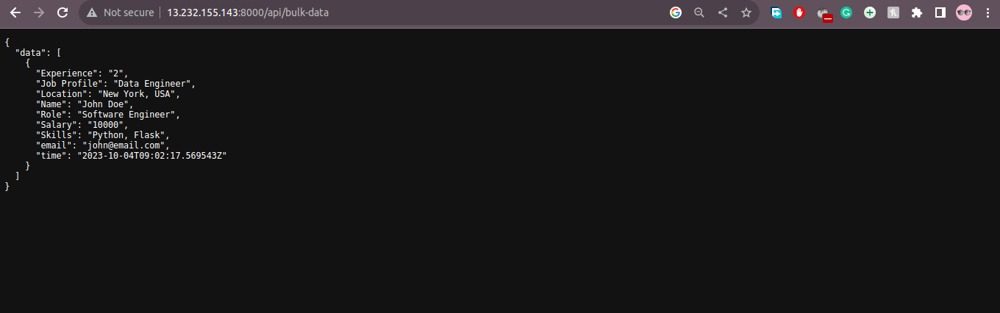
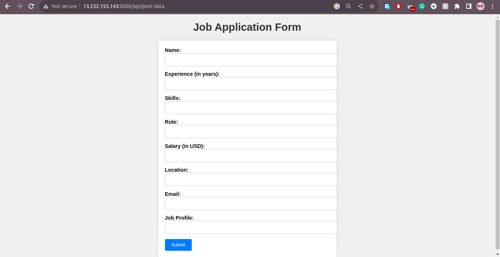
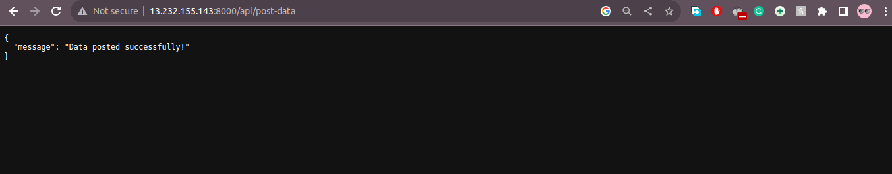

# Flask API using InfluxDB

## OS Ubuntu 20.0

### USED Technologies -
``` 
 python, flask, influxDB
```

# [Live Demo](http://13.232.155.143:8000/api/bulk-data)

### Create environment

```
    python3 -m venv flask-api-env
```
### Activate your env

```
    source flask-api-env/bin/activate
```

### Go to the project 

```
    cd flask-assignment
```

### Install requirements for the project:

   ```
   pip3 install -r requirements
   ```

### Start the Project


# Sample Outputs

## To get the Data visit [here](http://13.232.155.143:8000/api/post-data)



## To post data visit [here](http://13.232.155.143:8000/api/post-data)


## After Posting data 
